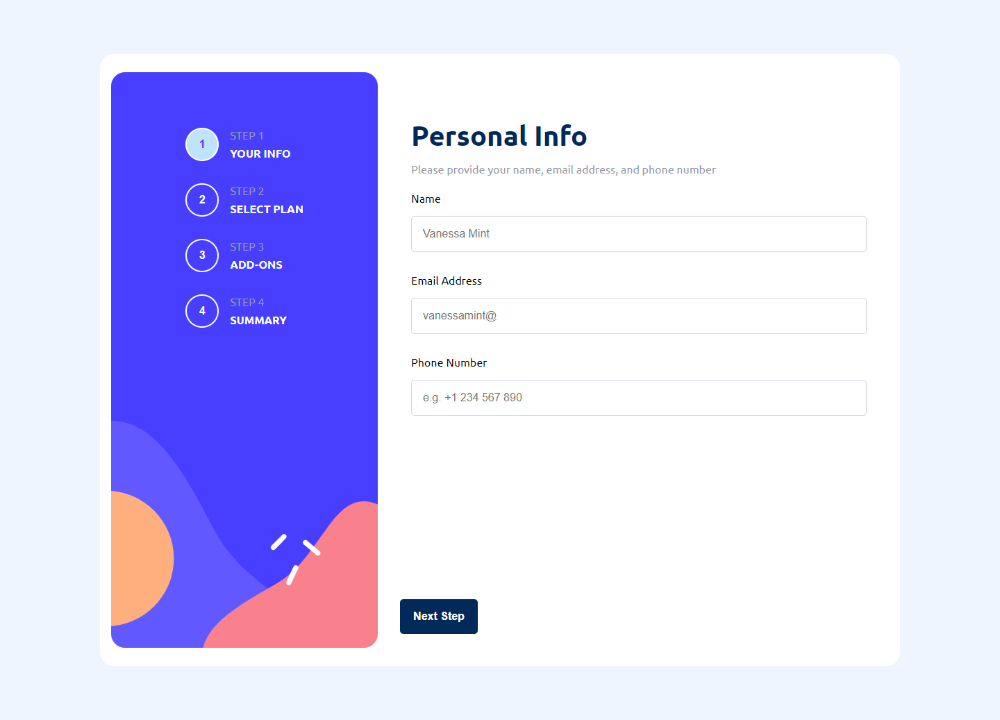
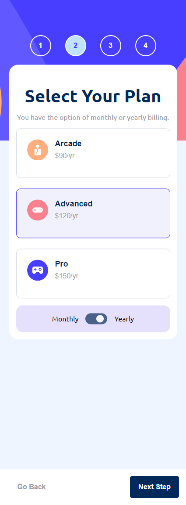
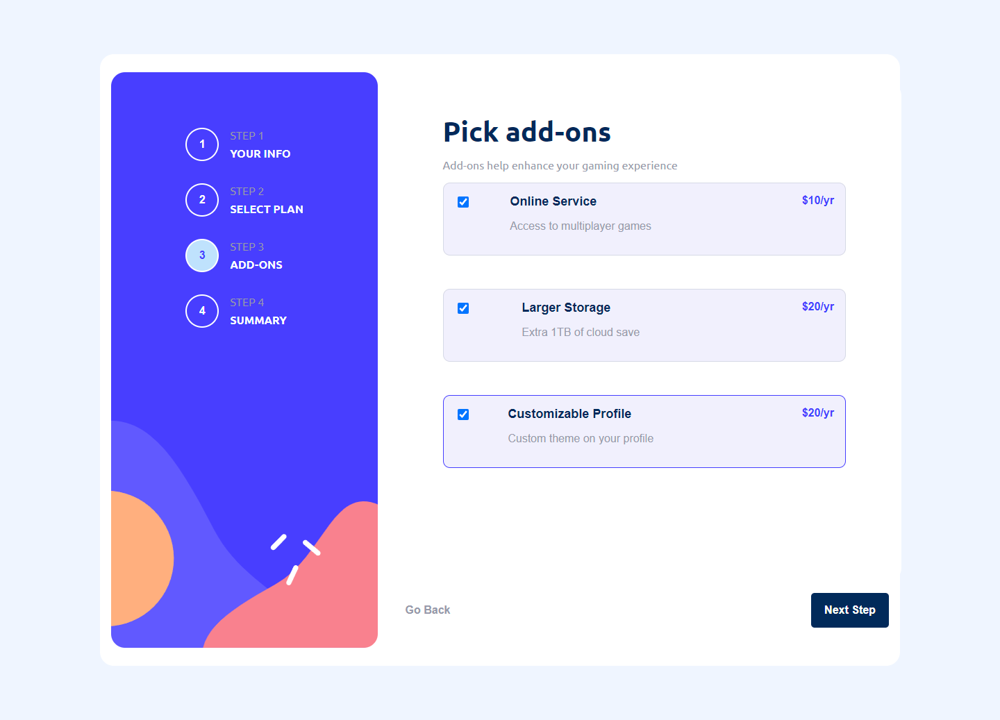
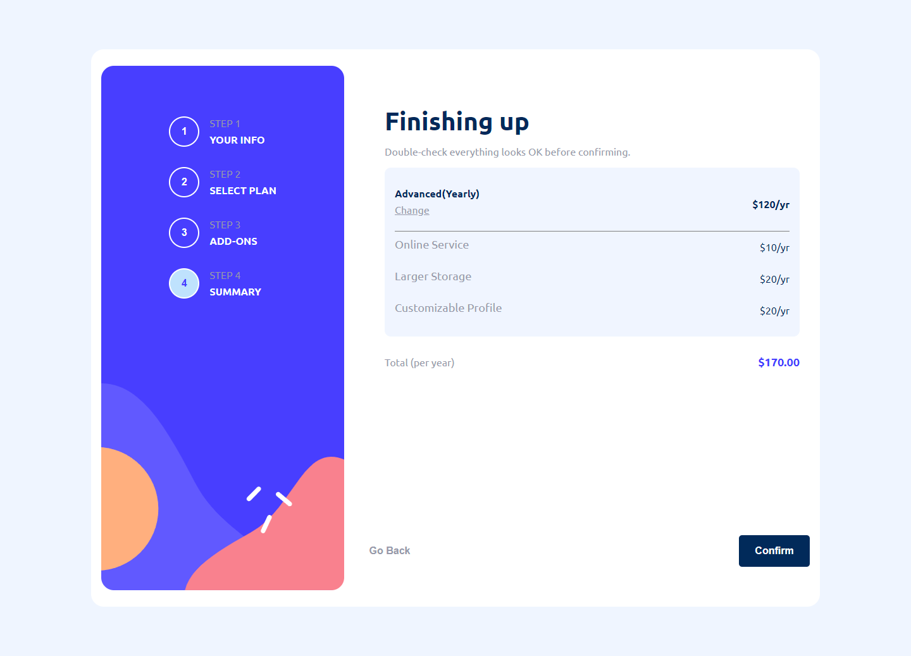
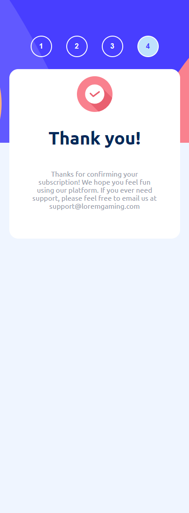

# Frontend Mentor - Multi-step form solution

This is a solution to the [Multi-step form challenge on Frontend Mentor](https://www.frontendmentor.io/challenges/multistep-form-YVAnSdqQBJ). Frontend Mentor challenges help you improve your coding skills by building realistic projects. 

## Table of contents

- [Overview](#overview)
  - [The challenge](#the-challenge)
  - [Screenshot](#screenshot)
  - [Links](#links)
- [My process](#my-process)
  - [Built with](#built-with)
  - [What I learned](#what-i-learned)
  - [Continued development](#continued-development)
  - [Useful resources](#useful-resources)
- [Author](#author)


## Overview

### The challenge

Users should be able to:

- Complete each step of the sequence
- Go back to a previous step to update their selections
- See a summary of their selections on the final step and confirm their order
- View the optimal layout for the interface depending on their device's screen size
- See hover and focus states for all interactive elements on the page
- Receive form validation messages if:
  - A field has been missed
  - The email address is not formatted correctly
  - A step is submitted, but no selection has been made

### Screenshot

#### Personal Info Step


#### Select Plan Step



#### Add-ons Step



#### Checkout Step



#### Thank You Step




### Links

- Solution URL: [Github Repo](https://github.com/botirk38/multi-step-form-main)
- Live Site URL: [Live Site](https://multi-step-form-botir.netlify.app/)

## My process

### Built with

- Semantic HTML5 markup
- CSS custom properties
- Flexbox
- CSS Grid
- Mobile-first workflow
- [React](https://reactjs.org/) - JS library
- [Typescript](https://www.typescriptlang.org/) - For type checking
- [Styled Components](https://styled-components.com/) - For styles


### What I learned

I learned how to type check data passed when the form is submitted, so we can avoid errors and bugs down the line, especially in an application where data is passed around a lot.

```tsx
const onSubmitForm: SubmitHandler<AddOnsProps> = (data) => {
        isSubmittingRef.current = true;
        const selectedAddOns = data.selectedAddOns || [];
        const individualPrices = calculateIndividualPrices(selectedAddOns, formData.selectedPlan.billingCycle);

        setFormData(prevState => ({
            ...prevState,
            AddOns: {
                selectedAddOns: selectedAddOns,
                selectedAddOnsPrice: calculateTotalPrice(selectedAddOns, formData.selectedPlan.billingCycle),
                individualAddOnsPrice: individualPrices
            }
        }));
    };

```

I also learned how to use the Context API to create a global state for the form data, so that we can access it from any component without having to pass it down as props. This is especially useful when we have a lot of nested components.

```tsx

export const FormContext = createContext<{
  formData: FormData;
  setFormData: React.Dispatch<React.SetStateAction<FormData>>;
}>({
  formData: {
    personalInfo: defaultPersonalInfo,
    selectedPlan: defaultSelectPlan,
    AddOns: defaultAddOns,
  
  },
  setFormData: () => {},
});

export const FormProvider: React.FC<{ children?: React.ReactNode }> = ({ children }) => {
  const [formData, setFormData] = useState<FormData>({
    personalInfo: defaultPersonalInfo,
    selectedPlan: defaultSelectPlan,
    AddOns: defaultAddOns,
  });

  return (
      <FormContext.Provider value={{ formData, setFormData }}>
          {children || null}
      </FormContext.Provider>
  );
};
```


### Continued development

- Connect the form to a backend so that the data can be saved to a database
- Add a progress bar to show the user how far along they are in the form


## Author

- Website - [Botir Khaltaev](https://portfolio-app-botir.netlify.app/)
- Frontend Mentor - [@botirk38](https://www.frontendmentor.io/profile/botirk38)


